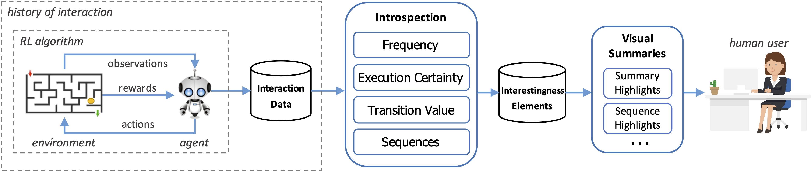

# Interestingness XRL



Interestingness XRL is a Python 3 library for eXplainable Reinforcement Learning (XRL) based on the concept of interestingness elements – these are elements of an agent’s history of interaction with its environment that might be relevant for understanding the agent’s aptitude, both its capabilities and limitations. The diagram above explains the workflow behind the framework. More details can be found in the accompanying [paper](https://arxiv.org/abs/1912.09007).

Each element defines a specific criterion to evaluate the agent’s interaction. The library can be plugged-in to any standard RL task with minimal effort, and provides different reporting methods, namely video highlights and sequences, behavior heatmaps and elements’ tracker. 

This framework provides implementations for standard RL algorithms like Q-Learning and SARSA. The code provides also a fully functional example for analyzing the behavior of different RL agents in the video-game of [Frogger](https://github.com/pedrodbs/frogger), but can easily be used with other environments that comply with [OpenAI's Gym](https://gym.openai.com/) (Gym) interface.

## Citation

Please cite the paper if you use the code in your research:
```
@article{Sequeira2020,
	Author = {Pedro Sequeira and Melinda Gervasio},
	Doi = {https://doi.org/10.1016/j.artint.2020.103367},
	Issn = {0004-3702},
	Journal = {Artificial Intelligence},
	Keywords = {Explainable AI, Reinforcement learning, Interestingness elements, Autonomy, Video highlights, Visual explanations},
	Pages = {103367},
	Title = {Interestingness elements for explainable reinforcement learning: Understanding agents' capabilities and limitations},
	Volume = {288},
	Year = {2020}
}
```

## **License notice** 

The code is provided under the GPLv3 license. To use the code under a different set of licensing terms, please contact [SRI International](https://www.sri.com/)'s licensing department at [licensee-ops@sri.com](mailto:licensee-ops@sri.com).

## Installation

```shell
pip install -e git+https://github.com/SRI-AIC/InterestingnessXRL.git
```

## Dependencies

- [numpy](https://numpy.org/)
- [OpenAI Gym](https://github.com/openai/gym)
- [pygame](https://www.pygame.org/)
- [PyGame-Learning-Environment](https://github.com/ntasfi/PyGame-Learning-Environment)
- [FP-Growth](https://github.com/evandempsey/fp-growth)
- [scipy](https://www.scipy.org/)
- [Matplotlib](https://matplotlib.org/)
- [pandas](https://pandas.pydata.org/)
- [pillow](https://python-pillow.org/)
- [jsonpickle](https://github.com/jsonpickle/jsonpickle)
- [palettable](https://jiffyclub.github.io/palettable)

To use the [Frogger](https://github.com/pedrodbs/frogger) environment, install with:
```shell
pip install -e git+https://github.com/pedrodbs/frogger.git#egg=frogger
```

## Usage
The following examples concern the default Frogger environment. All configurations can be edited in the default configurations file: `interestingness_xrl/scenarios/frogger/configurations.py`, including the number of episodes in each trial, the maximum timesteps per episode, the reward function, etc.

Train an agent for 100 trials via Q-learning using all available CPU cores:
```bash
python -m interestingness_xrl.bin.multi_agent_runner -a 0 -t 100
```

Test an agent for 1 trial (default = 2,000 episodes) and record some videos:
```bash
python -m interestingness_xrl.bin.agent_runner -a 1 -t 0 -v -rv
```

Run introspection analysis over the train+test data to extract interestingness elements:
```bash
python -m interestingness_xrl.bin.analyzer -a 1
```

Extract visualizations/reports from the extracted elements:
```bash
python -m interestingness_xrl.bin.report -a 1 -r 0
```

Options for the `-r` parameter above (report type) include:
- `0`: **Highlights**, recording videos highlighting important times of the agent's interaction according to the extracted interestingness elements.
- `1`: **Sequences** highlights, a special case of a video highlight capturing a sequence element.
- `2`: **Heatmaps**, which produces images based on agent location frequencies, observation, feature frequencies, game stats means and elements frequencies.
- `3`: **Tracker**, producing several videos, each visually-tracking (attention map) the different interestingness elements on the environment.

